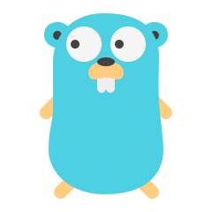

<h1 style="text-align: center">Самостоятельная практика по изучению Go</h1>
<h3 style="align-self: flex-start">Репозиторий временный, он создан специально для</h3>
<ol style="align-self: flex-start">
    <li>Отработки алгоритмов</li>
    <li>Освоения нового материала</li>
    <li>Обкатывания технологий новых проектов</li>
</ol>

